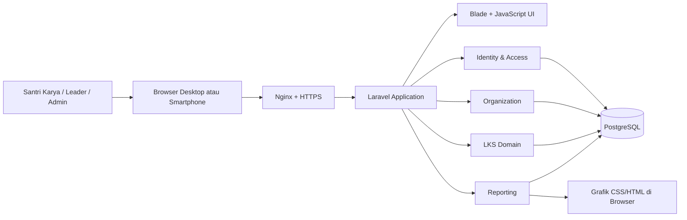
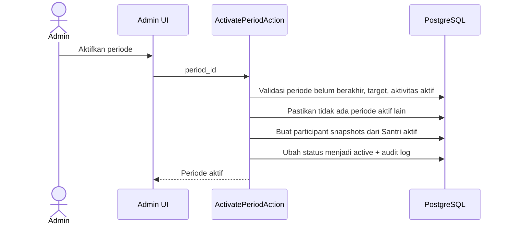
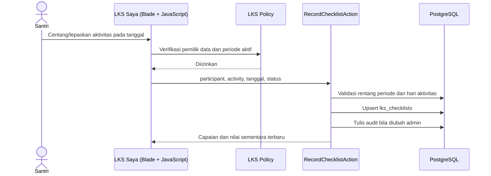

# Architecture System — LKS Santri Karya

## 1. Ringkasan arsitektur

LKS Santri Karya memakai arsitektur **modular monolith**: satu aplikasi Laravel, satu database PostgreSQL, dan satu deployment. Batas modul dibuat jelas di dalam kode agar aturan LKS tetap terpisah dari antarmuka dan pelaporan, tanpa membuat microservice yang belum diperlukan.



## 2. Prinsip arsitektur

1. **Checklist adalah sumber kebenaran.** Nilai, status, dan rekap selalu dapat dijelaskan dari checklist, target, bobot, serta ambang periode.
2. **Konfigurasi periode tidak mengubah masa lalu.** Aktivasi periode membuat snapshot peserta dan aktivitas agar riwayat tetap akurat.
3. **Akses dibatasi di server.** Menyembunyikan menu bukan otorisasi; route, Policy, query, dan endpoint grafik wajib memeriksa hak akses.
4. **Satu aturan perhitungan.** `LksScoreCalculator` digunakan oleh dashboard, LKS Saya, rekap, dan grafik.
5. **Sederhana dahulu.** Tidak ada API publik, microservice, cache cluster, atau queue wajib pada MVP.

## 3. Batas modul

| Modul | Tanggung jawab | Tidak bertanggung jawab atas |
|---|---|---|
| Identity & Access | Akun, login, peran, Policy, reset kata sandi | Struktur organisasi dan nilai LKS |
| Organization | Profil Santri, gender, tim, leader, departemen | Konfigurasi periode dan checklist |
| LKS | Periode, aktivitas, snapshot, checklist, kalkulasi | Rendering grafik dan manajemen akun |
| Reporting | Query rekap, filter, dataset grafik, tampilan laporan | Mengubah data checklist atau rumus bisnis |
| UI | Blade, JavaScript vanilla, navigasi, validasi pengalaman | Otorisasi final dan kalkulasi langsung |

Struktur direktori target:

```text
app/
  Domains/
    Identity/
    Organization/
    Lks/
      Actions/
      Models/
      Services/LksScoreCalculator.php
      Policies/
    Reporting/
  Http/Controllers/
    PrototypeDashboardController.php
    Lks/
  Http/
    Middleware/
    Requests/
resources/views/
  layouts/
  livewire/
routes/
  web.php
database/
  migrations/
  seeders/
docs/
```

Folder merupakan batas pengelompokan, bukan alasan membuat abstraction tambahan. Model kecil atau query sederhana tetap boleh dekat dengan modul pemakainya.

## 4. Komponen aplikasi

### 4.1 Identity & Access

- Laravel authentication menangani sesi login dan pemulihan kata sandi.
- Role utama: `santri`, `leader`, `admin`.
- Role dapat dikombinasikan; leader dapat tetap mengisi LKS pribadi.
- Policy menentukan apakah pengguna hanya melihat dirinya, anggota langsungnya, atau semua data.
- Akun tidak aktif tidak dapat masuk dan tidak otomatis dihapus dari riwayat.

### 4.2 Organization

- Menyimpan profil LKS, gender, departemen, tim, dan leader.
- Admin mengelola data master dan status aktif.
- Perubahan profil tidak menulis ulang hasil periode yang sudah aktif/selesai; snapshot periode menyimpan keadaan saat peserta dimasukkan.

### 4.3 LKS Domain

- Admin membuat periode dalam status `draft`.
- Admin menyalin aktivitas master ke konfigurasi periode dan mengatur target/bobot.
- Aktivasi periode secara atomik memvalidasi konfigurasi lalu membuat snapshot peserta aktif.
- Santri mengisi checklist pada periode aktif sesuai hak dan rentang tanggal.
- Penutupan periode mengunci perubahan melalui Policy/Service dan mencatat audit.

### 4.4 Reporting

- Rekap menggunakan snapshot peserta agar department, leader, dan gender periode tidak berubah di laporan historis.
- Dataset grafik hanya berisi hasil agregat yang dapat diakses pemanggil.
- Versi pertama menghitung nilai saat diminta; optimasi cache/materialized view baru ditambahkan jika pengukuran performa membuktikan perlu.

## 5. Alur data utama

### 5.1 Aktivasi periode



Admin dapat mengaktifkan periode draft sebelum tanggal mulai agar persiapan selesai lebih awal. Periode yang sudah aktif tetapi belum dimulai tetap menampilkan status menunggu pada dashboard dan checklist terkunci sampai tanggal mulai. Aktivasi gagal seluruhnya bila periode sudah berakhir, tidak ada aktivitas aktif, atau sudah ada periode aktif lain.

### 5.2 Pengisian checklist



`RecordChecklistAction` tidak menerima `user_id` bebas dari browser. Identitas peserta ditentukan dari sesi pengguna dan period snapshot yang sah.

### 5.3 Perhitungan dan rekap

```text
lks_checklists (completed)
  + period_activities (target, weight, aktif)
  + lks_periods (ambang akhir)
  → LksScoreCalculator
  → hasil individu
  → agregasi snapshot peserta menurut gender / leader / departemen
  → tabel rekap dan dataset grafik CSS/HTML
```

## 6. Otorisasi

| Aksi | Santri | Leader | Admin |
|---|---:|---:|---:|
| Melihat LKS pribadi | Ya | Ya | Ya |
| Mengubah checklist pribadi pada periode aktif | Ya | Ya | Ya |
| Melihat LKS anggota | Tidak | Hanya anggota langsung | Ya |
| Melihat rekap Ikhwan/Akhwat | Tidak | Hanya dalam cakupan anggota | Ya |
| Melihat rekap departemen | Tidak | Hanya cakupan yang disetujui | Ya |
| Mengelola Santri dan struktur | Tidak | Tidak | Ya |
| Mengelola periode/aktivitas | Tidak | Tidak | Ya |
| Menutup periode | Tidak | Tidak | Ya |

Detail cakupan leader untuk rekap departemen perlu dikonfirmasi saat aturan organisasi final ditetapkan. Sampai itu disetujui, leader hanya dapat melihat peserta yang `leader_user_id_snapshot`-nya sama dengan dirinya.

## 7. Rancangan UX untuk mode operate

Panduan ini menerapkan arah Impeccable pada kebutuhan operasional; ia bukan keputusan visual permanen seperti warna atau logo yang belum tersedia.

### LKS Saya: fokus satu tugas

- Periode aktif, progres total, dan tombol aksi hari ini muncul tanpa pengguna harus mencari di tabel panjang.
- Daftar tanggal dan aktivitas dirancang mobile-first; kontrol checklist memiliki target sentuh yang nyaman dan label aktivitas tetap terlihat.
- Perubahan memberi umpan balik segera: status tersimpan, jumlah capaian, dan progres terkini. Kegagalan simpan menjelaskan aksi pemulihan, bukan hanya menampilkan error teknis.
- Aktivitas yang belum tuntas disampaikan sebagai informasi tindakan, tanpa gamification atau nada menghakimi.
- Saat periode belum aktif atau telah ditutup, halaman menjelaskan kondisi dan menyediakan tautan ke riwayat bila relevan.

### Rekap: fokus pemindaian dan keputusan

- Filter periode selalu terlihat, lalu filter yang sesuai peran: gender, leader, dan departemen.
- Urutan awal memprioritaskan anggota yang belum tuntas, namun pengguna dapat mengubah urutan secara eksplisit.
- Kolom tetap ringkas: nama, unit organisasi relevan, nilai, dan status. Detail aktivitas dibuka pada halaman/detail terpisah agar tabel tetap mudah dibaca di ponsel.
- Grafik mendukung tabel, bukan menggantikannya; data ringkas dan tooltip harus tetap dapat diakses.

### Aksesibilitas dan responsivitas

- Status menggunakan teks `Tuntas`/`Belum Tuntas` selain warna dan ikon.
- Form dapat digunakan dengan keyboard, fokus terlihat, dan error dihubungkan dengan field terkait.
- Tabel rekap memiliki alternatif kartu atau kolom prioritas di layar kecil; tidak mengandalkan scroll horizontal sebagai satu-satunya cara menggunakan data.
- Kontras, ukuran teks, zoom browser, loading state, empty state, serta error state diperiksa sebelum UI dianggap selesai.

Semua perubahan antarmuka berikutnya wajib mengikuti `AGENTS.md`: jalankan `impeccable context` satu kali per sesi dan selesaikan workflow Impeccable yang relevan sebelum implementasi.

## 8. Keamanan dan integritas

- Password di-hash oleh Laravel; tidak pernah disimpan atau dicatat dalam log.
- HTTPS wajib di produksi; session cookie `secure`, `httpOnly`, dan `sameSite` dikonfigurasi sesuai deployment.
- CSRF protection aktif pada seluruh form web.
- Validasi server dilakukan untuk seluruh request HTTP.
- Policy membatasi akses object-level, bukan hanya berdasarkan tampilan menu.
- Rate limit diterapkan pada login dan reset kata sandi.
- Audit log menyimpan perubahan konfigurasi dan koreksi data signifikan.
- Backup database harian dan prosedur restore diuji sebelum go-live.

## 9. Operasi dan observabilitas

| Area | MVP |
|---|---|
| Log aplikasi | Laravel log dengan rotasi dan level error/warning. |
| Error tracking | Dapat ditambahkan setelah pemilihan layanan disetujui; tidak menjadi prasyarat fitur. |
| Backup | Dump PostgreSQL harian, disimpan di lokasi terpisah. |
| Scheduler | Cron memanggil Laravel scheduler setiap menit; belum ada job bisnis wajib pada MVP. |
| Health check | Endpoint ringan terautentikasi server atau pemeriksaan proses deployment. |
| Migrasi | Selalu melalui Laravel migration; tidak ada perubahan schema manual di produksi. |

## 10. Batas evolusi

| Kebutuhan masa depan | Jalur evolusi yang disiapkan |
|---|---|
| Aplikasi mobile | Tambah API Laravel terautentikasi tanpa memindahkan domain LKS. |
| Laporan besar/ekspor | Queue dan job ekspor setelah kebutuhan nyata ada. |
| Notifikasi | Laravel Notification setelah aturan waktu dan penerima disetujui. |
| Performa rekap tinggi | Materialized view/cache terkelola setelah metrik membuktikan kebutuhan. |
| Struktur leader bertingkat | Tambahkan hierarchy organisasi setelah aturan cakupan akses disetujui. |

Tidak satu pun evolusi ini diinisialisasi pada MVP agar scope tetap sesuai PRD.

