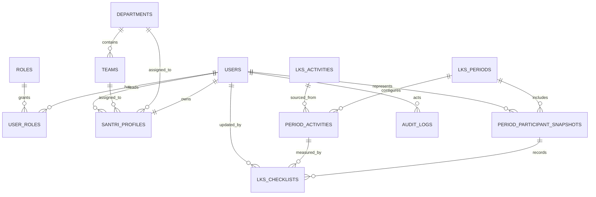

# Database Design — LKS Santri Karya

## 1. Tujuan desain

Desain ini menyimpan checklist harian sebagai sumber kebenaran, lalu menghitung capaian dan rekap dari data tersebut. Struktur periode menyimpan snapshot peserta, aktivitas, target, dan organisasi agar laporan historis tidak berubah ketika data master diperbarui.

Prinsip yang dipakai:

- PostgreSQL sebagai database relasional utama.
- UUID untuk primary key agar aman untuk integrasi dan tidak mudah ditebak.
- `created_at` dan `updated_at` pada data operasional.
- Tidak menyimpan nilai akhir sebagai sumber kebenaran pada versi pertama; nilai dihitung oleh layanan perhitungan dari checklist dan konfigurasi periode.
- Data periode selesai bersifat read-only pada level aplikasi.

## 2. ERD



## 3. Aturan relasi dan snapshot

| Aturan | Implementasi |
|---|---|
| Satu orang, satu LKS per periode | Kombinasi unik `period_id + user_id` pada `period_participant_snapshots`. |
| Satu checklist per tanggal dan aktivitas | Kombinasi unik `period_participant_id + period_activity_id + checklist_date`. |
| Target bisa berubah tiap periode | Target berada di `period_activities`, bukan di checklist atau master aktivitas. |
| Laporan historis tidak berubah | Nama dan struktur organisasi peserta disalin ke `period_participant_snapshots`; konfigurasi aktivitas disalin ke `period_activities`. |
| Periode selesai tidak dapat diubah | Dicegah pada Policy/Service Laravel; database tetap menjaga foreign key dan constraint. |

## 4. Tabel master identitas dan organisasi

### 4.1 `users`

Akun autentikasi Laravel.

| Kolom | Tipe | Aturan |
|---|---|---|
| `id` | uuid | PK |
| `name` | varchar(150) | wajib |
| `email` | varchar(255) | wajib, unik |
| `password` | varchar(255) | hash Laravel |
| `is_active` | boolean | default `true` |
| `email_verified_at` | timestamptz | nullable |
| `remember_token` | varchar(100) | nullable |
| `created_at`, `updated_at` | timestamptz | wajib |

### 4.2 `roles`

| Kolom | Tipe | Aturan |
|---|---|---|
| `id` | uuid | PK |
| `code` | varchar(30) | unik: `admin`, `leader`, `santri` |
| `name` | varchar(50) | wajib |

### 4.3 `user_roles`

Pivot peran pengguna. Model many-to-many mengizinkan seorang leader tetap mempunyai LKS pribadi sebagai Santri Karya.

| Kolom | Tipe | Aturan |
|---|---|---|
| `user_id` | uuid | FK → `users.id` |
| `role_id` | uuid | FK → `roles.id` |

Primary key gabungan: `user_id, role_id`.

### 4.4 `departments`

| Kolom | Tipe | Aturan |
|---|---|---|
| `id` | uuid | PK |
| `code` | varchar(30) | unik |
| `name` | varchar(100) | wajib |
| `is_active` | boolean | default `true` |
| `created_at`, `updated_at` | timestamptz | wajib |

### 4.5 `teams`

| Kolom | Tipe | Aturan |
|---|---|---|
| `id` | uuid | PK |
| `department_id` | uuid | FK → `departments.id`, nullable bila tim lintas departemen |
| `code` | varchar(30) | unik |
| `name` | varchar(100) | wajib |
| `is_active` | boolean | default `true` |
| `created_at`, `updated_at` | timestamptz | wajib |

### 4.6 `santri_profiles`

Profil LKS yang melekat pada akun.

| Kolom | Tipe | Aturan |
|---|---|---|
| `user_id` | uuid | PK dan FK → `users.id` |
| `gender` | varchar(10) | `ikhwan` atau `akhwat` |
| `department_id` | uuid | FK → `departments.id`, nullable |
| `team_id` | uuid | FK → `teams.id`, nullable |
| `leader_user_id` | uuid | FK → `users.id`, nullable, tidak boleh sama dengan `user_id` |
| `category` | varchar(100) | nullable |
| `level` | varchar(100) | nullable |
| `status` | varchar(15) | `active` atau `inactive` |
| `created_at`, `updated_at` | timestamptz | wajib |

> Catatan: konsistensi bahwa leader memiliki peran `leader`, dan bahwa tim selaras dengan departemen bila keduanya terisi, dijaga oleh validasi aplikasi. Kebutuhan organisasi yang lebih ketat dapat ditambahkan setelah aturan sumber datanya disepakati.

## 5. Tabel konfigurasi LKS

### 5.1 `lks_periods`

| Kolom | Tipe | Aturan |
|---|---|---|
| `id` | uuid | PK |
| `name` | varchar(100) | wajib, contoh `September 2026` |
| `start_date` | date | wajib |
| `end_date` | date | wajib, harus ≥ `start_date` |
| `status` | varchar(15) | `draft`, `active`, atau `closed` |
| `final_passing_threshold` | numeric(5,2) | default `90.00`, rentang 0–100 |
| `activated_at` | timestamptz | nullable |
| `closed_at` | timestamptz | nullable |
| `created_by` | uuid | FK → `users.id` |
| `created_at`, `updated_at` | timestamptz | wajib |

Indeks/constraint penting:

- `CHECK (end_date >= start_date)`.
- Hanya satu periode berstatus `active`, menggunakan partial unique index pada `status = 'active'`.
- Periode baru harus `draft`; aktivasi dilakukan melalui service agar peserta dan konfigurasi dapat disnapshot secara atomik.
- Periode draft dapat diaktifkan sebelum tanggal mulai untuk persiapan, tetapi checklist tetap hanya dapat dicatat dalam rentang tanggal periode.

### 5.2 `lks_activities`

Master katalog aktivitas yang dapat digunakan kembali.

| Kolom | Tipe | Aturan |
|---|---|---|
| `id` | uuid | PK |
| `code` | varchar(50) | unik, stabil, contoh `shalat_dhuha` |
| `name` | varchar(150) | wajib |
| `description` | text | nullable |
| `is_active` | boolean | default `true` |
| `sort_order` | smallint | default `0` |
| `created_at`, `updated_at` | timestamptz | wajib |

### 5.3 `period_activities`

Snapshot konfigurasi aktivitas untuk satu periode.

| Kolom | Tipe | Aturan |
|---|---|---|
| `id` | uuid | PK |
| `period_id` | uuid | FK → `lks_periods.id` |
| `activity_id` | uuid | FK → `lks_activities.id`, nullable setelah snapshot bila master diarsipkan |
| `activity_code_snapshot` | varchar(50) | wajib |
| `activity_name_snapshot` | varchar(150) | wajib |
| `target_count` | integer | wajib, > 0 |
| `weight` | numeric(8,2) | default `1.00`, > 0 |
| `allowed_weekdays` | smallint[] | nullable; 1–7 untuk pembatasan hari, misalnya Kamis |
| `is_active` | boolean | default `true` |
| `sort_order` | smallint | default `0` |
| `created_at`, `updated_at` | timestamptz | wajib |

Constraint unik: `period_id, activity_code_snapshot`.

`allowed_weekdays` adalah opsi konfigurasi, bukan syarat untuk setiap aktivitas. Bila kosong, aktivitas dapat dicatat pada semua tanggal di dalam periode. Ini memungkinkan aturan seperti Puasa Kamis tanpa membuat model aktivitas terpisah.

## 6. Tabel transaksi dan audit

### 6.1 `period_participant_snapshots`

Peserta LKS dan struktur organisasi saat periode diaktifkan.

| Kolom | Tipe | Aturan |
|---|---|---|
| `id` | uuid | PK |
| `period_id` | uuid | FK → `lks_periods.id` |
| `user_id` | uuid | FK → `users.id` |
| `participant_name_snapshot` | varchar(150) | wajib |
| `gender_snapshot` | varchar(10) | wajib |
| `department_id_snapshot` | uuid | nullable, referensi informatif |
| `department_name_snapshot` | varchar(100) | nullable |
| `team_id_snapshot` | uuid | nullable, referensi informatif |
| `team_name_snapshot` | varchar(100) | nullable |
| `leader_user_id_snapshot` | uuid | nullable, referensi informatif |
| `leader_name_snapshot` | varchar(150) | nullable |
| `category_snapshot` | varchar(100) | nullable |
| `level_snapshot` | varchar(100) | nullable |
| `created_at` | timestamptz | wajib |

Constraint unik: `period_id, user_id`.

### 6.2 `lks_checklists`

Sumber kebenaran pengisian harian.

| Kolom | Tipe | Aturan |
|---|---|---|
| `id` | uuid | PK |
| `period_participant_id` | uuid | FK → `period_participant_snapshots.id` |
| `period_activity_id` | uuid | FK → `period_activities.id` |
| `checklist_date` | date | wajib |
| `is_completed` | boolean | default `true` |
| `recorded_by_user_id` | uuid | FK → `users.id` |
| `created_at`, `updated_at` | timestamptz | wajib |

Constraint unik: `period_participant_id, period_activity_id, checklist_date`.

Validasi aplikasi wajib memastikan tanggal berada dalam rentang periode, aktivitas milik periode yang sama, aktivitas aktif, serta hari pengisian sesuai `allowed_weekdays` apabila dikonfigurasi.

### 6.3 `audit_logs`

Jejak perubahan yang berdampak pada integritas data.

| Kolom | Tipe | Aturan |
|---|---|---|
| `id` | uuid | PK |
| `actor_user_id` | uuid | FK → `users.id`, nullable untuk proses sistem |
| `event` | varchar(100) | wajib, contoh `period.activated` |
| `auditable_type` | varchar(100) | wajib |
| `auditable_id` | uuid | wajib |
| `before_data` | jsonb | nullable |
| `after_data` | jsonb | nullable |
| `created_at` | timestamptz | wajib |

Audit minimal mencatat aktivasi/penutupan periode, perubahan target, perubahan organisasi pengguna, dan perubahan checklist oleh pihak selain pemiliknya.

## 7. Rumus perhitungan

Perhitungan dilakukan dalam `LksScoreCalculator` dan tidak ditulis ulang pada controller atau view.

```text
completed_count(activity) = jumlah checklist dengan is_completed = true

activity_percentage = min(completed_count / target_count, 1) × 100

activity_status = Tuntas jika completed_count ≥ target_count
                  selain itu Belum Tuntas

final_percentage =
  Σ(activity_percentage × weight) / Σ(weight untuk aktivitas aktif)

final_status = Tuntas jika final_percentage ≥ final_passing_threshold
               selain itu Belum Tuntas
```

Aturan batasan:

- Capaian aktivitas dibatasi maksimal 100%; checklist di atas target tidak menaikkan nilai lebih dari target.
- Aktivitas tidak aktif tidak masuk pembilang maupun penyebut nilai akhir.
- Target dan bobot harus positif; periode tidak boleh diaktifkan tanpa sedikitnya satu aktivitas aktif.
- Pembulatan tampilan menjadi dua angka desimal. Perhitungan internal menggunakan `numeric`, bukan floating point.

## 8. Strategi rekap

Pada versi pertama, rekap dihitung lewat query agregasi dari `period_participant_snapshots`, `period_activities`, dan `lks_checklists`. Tidak diperlukan tabel rekap terpisah selama volume data masih rendah hingga menengah.

| Rekap | Pengelompokan |
|---|---|
| Individu | `period_participant_id` |
| Ikhwan/Akhwat | `gender_snapshot` |
| Leader | `leader_user_id_snapshot` |
| Departemen | `department_id_snapshot` / `department_name_snapshot` |

Jika performa kelak memerlukan optimasi, tambahkan materialized view atau tabel cache terkelola setelah metrik nyata tersedia; jangan menyimpannya sebagai sumber kebenaran kedua pada MVP.

## 9. Indeks yang diperlukan

1. `users(email)` unik.
2. `santri_profiles(leader_user_id)`, `santri_profiles(department_id)`, dan `santri_profiles(team_id)`.
3. `lks_periods(status)` serta partial unique index untuk periode aktif.
4. `period_activities(period_id, is_active)`.
5. `period_participant_snapshots(period_id, user_id)` unik; indeks `(period_id, gender_snapshot)`, `(period_id, leader_user_id_snapshot)`, dan `(period_id, department_id_snapshot)`.
6. `lks_checklists(period_participant_id, period_activity_id, checklist_date)` unik dan indeks tambahan `(period_activity_id, checklist_date)` untuk agregasi.
7. `audit_logs(auditable_type, auditable_id, created_at desc)`.

## 10. Kebijakan integritas dan penghapusan

- Master pengguna, tim, departemen, dan aktivitas menggunakan status aktif/nonaktif; jangan dihapus bila sudah dipakai periode.
- Tidak ada cascade delete dari master ke data periode atau checklist.
- Periode, konfigurasi periode, snapshot peserta, dan checklist tidak dihapus dari aplikasi produksi; koreksi tercatat sebagai audit.
- `foreign key` pada snapshot organisasi boleh menggunakan `SET NULL` untuk referensi master, karena nama snapshot tetap menjadi arsip yang valid.

## 11. Keputusan kebijakan yang disetujui

Keputusan berikut menjadi aturan implementasi MVP:

1. Checklist tanggal lampau dapat diedit selama periode berstatus `active`.
2. Admin dapat mengoreksi checklist milik Santri dengan alasan wajib dan audit log.
3. Semua aktivitas memakai bobot sama pada MVP. Kolom `weight` tetap tersedia untuk evolusi berikutnya, tetapi Service menetapkan nilai `1.00` dan UI admin belum mengubahnya.
4. Setiap tim wajib berada pada satu departemen. Validasi aplikasi memastikan departemen profil sesuai dengan departemen tim.
5. Admin dapat menambahkan peserta secara manual ke periode aktif. Snapshot menyimpan `participation_start_date`, sehingga checklist tidak dapat diisi mundur sebelum tanggal tersebut.

Implementasi schema menegakkan departemen wajib pada tim serta menyediakan `participation_start_date` dan `audit_logs.reason`. Validasi lintas tabel dan aturan edit tetap berada pada Service/Policy Laravel.

